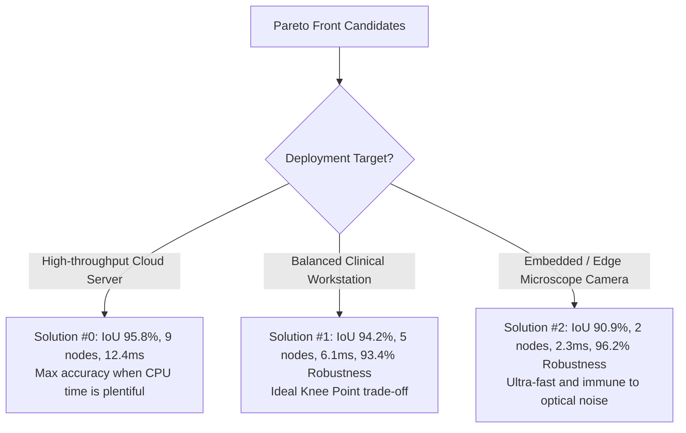

# Quick Start Tutorial

In this end-to-end tutorial, you will learn how to:

1. Load biomedical image data with ground-truth segmentation masks.
2. Formulate multi-objective criteria balancing **segmentation accuracy** with **graph complexity** and **inference speed**.
3. Launch evolutionary search with `KartezioMOOTrainer`.
4. Read the automatically generated Pareto-front and robustness console summary.
5. Export results to CSV for analysis.
6. Interpret trade-offs to select an optimal pipeline for your target deployment environment.

---

## Step 1: Loading Training Data

Kartezio works with standard 8-bit or floating-point NumPy image arrays. In this tutorial, we use Kartezio's built-in `one_cell_dataset()`, which provides a confocal microscopy cell image and its corresponding binary mask:

```python
import numpy as np
from kartezio.utils.dataset import one_cell_dataset

# Load single-cell image and binary annotation
train_x, train_y = one_cell_dataset()

# train_x: list of images (each of shape [C, H, W] or [H, W])
# train_y: list of target masks with 0 for background and 255 for cell
print(f"Loaded {len(train_x)} training sample(s).")
print(f"Image shape: {train_x[0][0].shape}, dtype: {train_x[0][0].dtype}")
```

> [!TIP]
> Kartezio operates on standard OpenCV formats. You can load your own images using `cv2.imread("image.png", cv2.IMREAD_GRAYSCALE)` and wrap them in a nested list: `x = [[[image]]]; y = [[[mask]]]`.

---

## Step 2: Defining Multi-Objective Optimization Targets

Rather than collapsing all goals into an arbitrary weighted single score, **multi-objective optimization** keeps each criterion separate.

We will configure three objectives:

1. **Segmentation Accuracy (`PerformanceObjective(IoU())`)**: Measures the Intersection over Union (Jaccard Index) between predicted foreground pixels and true ground truth. (Internally minimized as $1.0 - \text{IoU}$).
2. **Graph Complexity (`ActiveNodeCount()`)**: Counts how many active functional nodes are wired into the final output. Silent/inactive nodes are excluded.
3. **Execution Latency (`ProcessTime()`)**: Measures the wall-clock execution time (in milliseconds) required to process an image.

```python
from kartezio.core.endpoints import EndpointThreshold
from kartezio.core.fitness import IoU
from kartezio.moo import (
    ActiveNodeCount,
    PerformanceObjective,
    ProcessTime,
)
from kartezio.primitives.matrix import default_matrix_lib

# 1. Computer Vision primitives library (blur, morphological ops, arithmetic)
libraries = default_matrix_lib()

# 2. Pipeline endpoint: binarize output image at threshold value 128
endpoint = EndpointThreshold(threshold=128)

# 3. Define multi-objective targets
objectives = [
    PerformanceObjective(fitness_metric=IoU()),
    ActiveNodeCount(),
    ProcessTime(),
]
```

---

## Step 3: Running the Evolutionary Search

We instantiate `KartezioMOOTrainer`. Under the hood, this sets up Cartesian Genetic Programming coupled with the **NSGA-II** selection strategy:

```python
from kartezio.moo import KartezioMOOTrainer

# Configure trainer
trainer = KartezioMOOTrainer(
    n_inputs=1,  # 1 channel (grayscale)
    n_nodes=20,  # Max available nodes in CGP grid
    libraries=libraries,  # OpenCV primitives
    endpoint=endpoint,  # Thresholding endpoint
    objectives=objectives,  # Multi-objective criteria
    population_size=16,  # 16 candidate pipelines per generation
)

# Set mutation rate: probability of mutating a node operation or connection
trainer.set_mutation_rates(node_rate=0.08, out_rate=0.15)

# Run evolution for 30 generations
# Upon completion, fit() automatically runs robustness evaluation on the test set!
pareto_pop = trainer.fit(
    n_generations=30,
    x_train=train_x,
    y_train=train_y,
    x_test=train_x,
    y_test=train_y,
)
```

---

## Step 4: Understanding the Console Output

When `trainer.fit()` finishes, it automatically runs the **post-hoc robustness battery** across all Pareto-optimal solutions and prints a structured summary table directly to stdout:

```text
========================================================================================
                      PARETO FRONT & ROBUSTNESS SUMMARY REPORT
========================================================================================
 Solution ID | Pareto Rank |   IoU Loss | Active Nodes | Time (ms) | Robustness Score
----------------------------------------------------------------------------------------
 #0          |      0      |     0.042  |       9      |    12.4   |      0.891
 #1          |      0      |     0.058  |       5      |     6.1   |      0.934
 #2          |      0      |     0.091  |       2      |     2.3   |      0.962
 #3          |      1      |     0.075  |       8      |    11.8   |      0.840
========================================================================================
* Robustness Score: Mean retention of segmentation performance under Gaussian noise,
  blur, brightness shift, contrast scaling, and JPEG compression [0.0 to 1.0].
```

### Key Columns Explained:
- **Solution ID**: Index of the candidate pipeline in the evolved population.
- **Pareto Rank**:
  - `0`: Non-dominated solutions that form the **Pareto frontier**. No other pipeline is strictly superior across all metrics.
  - `> 0`: Dominated solutions retained in secondary fronts.
- **IoU Loss**: $1.0 - \text{IoU}$. Lower is better. A loss of `0.042` represents an outstanding IoU of $95.8\%$.
- **Active Nodes**: Number of active operations in the pipeline graph.
- **Time (ms)**: Average wall-clock inference latency per image.
- **Robustness Score**: Mean retention of performance across the 5 synthetic perturbation stress-tests (range $0.0$ to $1.0$, where $1.0$ indicates zero degradation under noise/blur).

---

## Step 5: Exporting Results to CSV

You can convert the Pareto front and its associated robustness metrics into a `pandas.DataFrame` and save it to disk for reports or plotting:

```python
from pathlib import Path

# Extract DataFrame directly from the annotated population
df = pareto_pop.to_dataframe()

# Save to CSV
output_path = Path("pareto_front_results.csv")
df.to_csv(output_path, index=False)
print(f"Results successfully saved to {output_path.resolve()}")
```

---

## Step 6: Choosing the Best Pipeline for Deployment

The Pareto front gives you the freedom to choose the right trade-off depending on where your algorithm will run:



1. **Cloud Server Batch Processing**: If accuracy is paramount and compute is unconstrained, choose **Solution #0** (highest IoU, lowest loss).
2. **Balanced Workflow (Knee Point)**: **Solution #1** sacrifices only $1.6\%$ IoU compared to Solution #0, but halves the execution time ($6.1\text{ ms}$ vs $12.4\text{ ms}$) and achieves higher real-world noise resilience ($93.4\%$).
3. **Embedded / Edge Microscope**: **Solution #2** uses only 2 operations, executes in just $2.3\text{ ms}$, and retains $96.2\%$ of its accuracy under severe perturbations.

---

## Next Steps

- Check the [Multi-Objective Guide](moo_guide.md) to learn how NSGA-II works internally and how to implement custom complexity metrics.
- Read the [Robustness Evaluation Guide](robustness_guide.md) for details on individual image perturbations and how to plot perturbation breakdowns.
